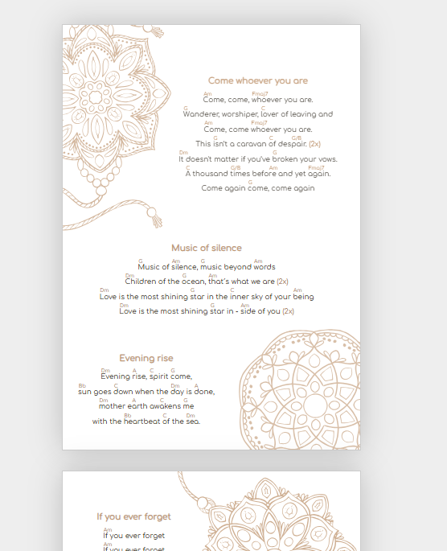

# Hackable Mini Layout Tool

This project started, when I tried to layout lyrics with chords for printing a music sheet.
It evolved to a small hackable layout-tool with different input "parsers" that allow formatting any input and bringing it to html.



I tried to keep it simple-stupid, the only dependency is [Bun](https://bun.sh/).
It still has lots of bugs and missing features but served my purpose and might be a starting point for you.

I'm not going to fix issues (because there are too many and there are already a lot of editors out there).
But I'm interested in PRs which improve the project and where the project can still be called "simple-stupid" after merging ;)

Thanks and have fun!


## Get it running

Make sure you have [Bun](https://bun.sh/) installed (it's really nice, like node.js and npm combined).
```bash
bun install
bun start
```

Then open http://localhost:3001 in your browser.

All files you drag on your page (currently only images and .txt) land in the ``./user`` subdirectory.
Element positions and transformations are stored in ``./user/settings.json`` so your changes are stored between browser-reloads.

Transform images/text with alt/strg/shift + mouse-wheel (rotation/scale/opacity).

## Parsers

The core functionality revolves around parsing different types of input files. The system uses a set of parsers to handle various file formats, as defined in `src/parsers/index.ts`:

*   **Chord Parser (`chordParser.ts`):** Processes text files (`.txt`) identified as chord sheets. It extracts information from these files.
*   **HTML Parser (`htmlParser.ts`):** Handles HTML files (`.html`, `.htm`), enabling the use of rich text content.
*   **SVG Parser (`svgParser.ts`):** Parses Scalable Vector Graphics files (`.svg`), for displaying vector-based images.
*   **Image Parser (`imageParser.ts`):** Manages common image formats (`.jpg`, `.png`, `.gif`, etc.), allowing images to be included.

When a file is processed, the `findParser` function in `src/parsers/index.ts` identifies the correct parser based on the file's extension. It can also perform basic content sniffing (e.g., checking if content starts with `<svg>`) if the extension is not definitive.

The `parseContent` function then uses the selected parser to convert the file's content into a structured format. This involves creating an element and determining its dimensions (width, height) as per the `ParsedItemData` type.

The project also includes `interactions` components, suggesting functionality for users to interact with and arrange these parsed elements.


## Interactions

The interaction-logic consists of multiple files (in /src/interactions) and is built with ``bun build:interactions``.
